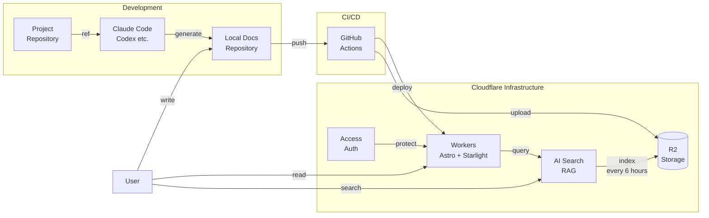

# cloudflare-stack-docs

Cloudflare で作るドキュメントシステム。

## Usage

> [!NOTE]
> 現在、以下の GitHub Actions ワークフローが一時的に無効化されています：
> - **自動デプロイ**（[deploy.yaml](./.github/workflows/deploy.yaml)）：18 行目の `if: false` を削除またはコメントアウトして有効化
> - **R2 へのアップロード**（[upload-to-r2.yml](./.github/workflows/upload-to-r2.yml)）：19 行目の `if: false` を削除またはコメントアウトして有効化

最低限、以下の設定によってデプロイが可能。

1. プロフィール -> API トークンから、Workers スクリプトの編集権限を付与してユーザー API トークンを作成する。作成したトークンの値を次の環境変数で GitHub Actions の secret に追加する。

    - CLOUDFLARE_API_TOKEN : Cloudflare Workers を編集する権限を持つ API Token
    - CLOUDFLARE_ACCOUNT_ID : Cloudflare アカウント ID（ダッシュボードの右サイドバーで確認可能）

2. Cloudflare Workers のアプリケーションを Workers and Pages のページから作成する。作成時は Continue with GitHub を利用し、作成後に設定画面からリポジトリとの接続を解除すると良い。なお、Cloudflare Workers へのデプロイは mermaid で作成した図の描画のために GitHub Actions 経由で行うようにしてある（[deploy.yaml](./.github/workflows/deploy.yaml)）。

3. Cloudflare AI Search の接続先の R2 の Bucket を作成する。その後、[R2 - API - Authentication](https://developers.cloudflare.com/r2/api/tokens/) を参考に、アクセス許可「オブジェクト読み取りと書き込み」で User API トークンを作成する。Access Key ID、Secret Access Key を GitHub Actions の secret に追加する。

    - R2_ACCESS_KEY_ID : ドキュメントを保存する R2 のアクセスキーID
    - R2_SECRET_ACCESS_KEY : ドキュメントを保存する R2 のシークレットキー

4. AI Search の UI から AI Search のインスタンスを立てる。利用する R2 バケットには 3 で作成したものを利用する。AI Gateway は default のものか自身で作成したものを選択する。インデックスの作成に利用する LLM を選択する（ここで選択した LLM は変更不可であることに注意）。残りの項目は後から変更可能であるため、適当に選択してインスタンスを作成する。

5. [search.ts](./src/pages/api/search.ts) の `RAG_NAME` を 4 で作成した AI Search のインスタンス名に変更する。

6. [upload-to-r2.yaml](./.github/workflows/upload-to-r2.yaml) の `R2_BUCKET_NAME` を 3 で作成したバケット名に変更する。

7. [deploy.yaml](./.github/workflows/deploy.yaml) を手動実行してデプロイし、`https://<YOUR_ACCOUNT_NAME>.workers.dev/` にアクセスできることを確認する。また、`/search` にアクセスし、RAG の機能が確認できることを確認する。

上記設定に加え、必要に応じて、Cloudflare Access などによる認証・認可を設定する。Workers のドメインの項目から設定可能。

以下を参考にすると良い。
- [Cloudflare Access Controls](https://developers.cloudflare.com/cloudflare-one/access-controls/policies/)
- [GitHub アカウントでの認証設定](https://developers.cloudflare.com/cloudflare-one/integrations/identity-providers/github/)

## Architecture

### System Overview

## Tech Stack

### Framework

Starlight を採用することで、ドキュメントのホスティングにより特化させる。

- [Astro](https://astro.build/) - 静的サイトジェネレーター
- [Starlight](https://starlight.astro.build/) - Astro ベースのドキュメントテーマ

### Infrastructure

Cloudflare Stack を採用し、RAG も含めて安価に運用する。

- **Cloudflare Workers**: ホスティング環境
- **Cloudflare R2**: ドキュメントのオブジェクトストレージ
- **Cloudflare AI Search**: RAG による検索機能
- **Cloudflare Access**: 認証・認可（オプション）

### Development Tools

- [pnpm](https://pnpm.io/) - パッケージマネージャー
- [textlint](https://github.com/textlint/textlint) - 日本語文章の校正ツール
    - [textlint-ja/textlint-rule-preset-ja-technical-writing](https://github.com/textlint-ja/textlint-rule-preset-ja-technical-writing) を利用
