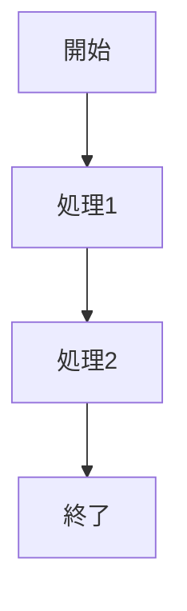

# 機能名

| 項目 | 内容 |
| --- | --- |
| Author | @your-name |
| Created | YYYY-MM-DD |
| Updated | YYYY-MM-DD |
| Status | Draft / In Review / Approved / Implemented |

## Overview

（この設計の概要を1〜2文で記述）

## Context

### 背景

（なぜこの設計が必要なのか、ビジネス的・技術的な背景を記述）

### 現状の問題点

（解決すべき課題や問題点を記述）

## Goals and Non-Goals

### Goals

- 達成したいこと1
- 達成したいこと2

### Non-Goals

- この設計では対象外とすること1
- この設計では対象外とすること2

---

## Design

### 概要

（設計の全体像を記述）

### 詳細設計

#### データ構造

（必要に応じてデータ構造を記述）

#### 処理フロー

（処理の流れを記述）

#### API / インターフェース

（API やインターフェースの変更がある場合）

### 画面・機能

| 画面 | 機能 | 機能詳細 |
| --- | --- | --- |
|  |  |  |

### デザインリンク

（Figma などのデザインリンク）

---

## Alternatives Considered

### 案1: （代替案のタイトル）

（代替案の概要）

**Pros:**
- メリット1

**Cons:**
- デメリット1

**採用しなかった理由:**
（理由を記述）

---

## Impact

### 影響範囲

- 影響を受けるモジュール・機能

### マイグレーション

（既存データや既存機能への影響とマイグレーション方法）

### リスク

- 潜在的なリスクと対策

---

## Testing

### テスト観点

- [ ] テスト項目1
- [ ] テスト項目2

---

## Open Questions

- [ ] 未決定事項1
- [ ] 未決定事項2

---

## References

- 参考リンク
