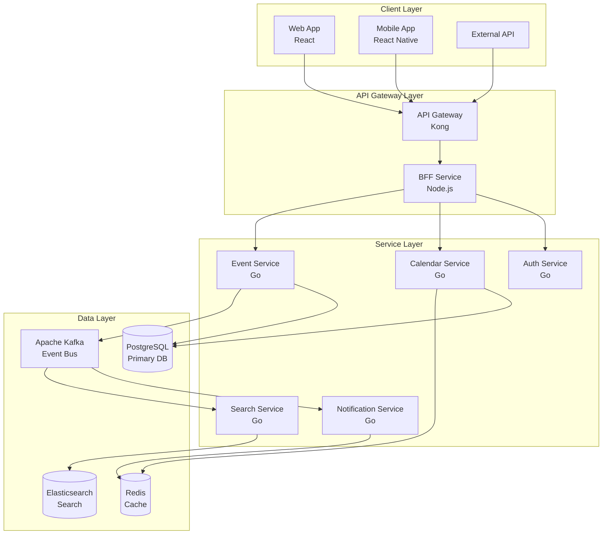

# カレンダーシステムアーキテクチャ

| 項目 | 内容 |
| --- | --- |
| Author | @Architecture-Team |
| Created | 2025-12-05 |
| Updated | 2025-12-14 |
| Status | Approved |

## Overview

エンタープライズグレードのカレンダーシステムの技術アーキテクチャを定義し、マイクロサービスアーキテクチャとクラウドネイティブ原則に基づく高可用性システムを実現します。

## Context

### 背景

現代のエンタープライズ環境では、カレンダーシステムは単なるスケジュール管理ツールを超えて、組織全体の生産性を支える基幹システムとなっています。グローバル展開、リモートワークの増加、外部システムとの連携需要により、高度な技術アーキテクチャが求められています。

年間10億件を超えるイベントを処理し、100万人規模のユーザーベースに対応できる、拡張可能で信頼性の高いシステムが必要です。

### 現状の問題点

- **モノリシックアーキテクチャの限界**: 既存システムの垂直スケーリングが限界に達している
- **可用性の不足**: 単一障害点により、年間20時間以上のダウンタイム発生
- **パフォーマンスボトルネック**: ピーク時のレスポンス時間が3秒を超える
- **セキュリティリスク**: レガシーシステムのセキュリティ脆弱性

## Goals and Non-Goals

### Goals

- 99.95%の可用性を実現（年間ダウンタイム4.38時間以内）
- 10,000リクエスト/秒の処理能力を確保
- P95レスポンス時間を200ms以内に抑制
- 水平スケーリングによる無制限の拡張性を提供
- ゼロトラストセキュリティモデルの実装

### Non-Goals

- レガシーシステムの完全な置き換え（段階的移行を採用）
- すべての機能の同時リリース（MVPから段階的に拡張）
- オンプレミス展開のサポート（クラウドファーストで設計）
- 無制限のデータ保持（コンプライアンスに基づく保持ポリシー）

---

## Design

### 概要

マイクロサービスアーキテクチャを採用し、各サービスは単一責任の原則に従って設計されます。イベント駆動アーキテクチャにより、サービス間の疎結合を実現し、非同期通信を活用してスケーラビリティを確保します。

### 詳細設計

#### データ構造

**技術スタック:**
```yaml
backend:
  - language: Go
    purpose: gRPCマイクロサービス
  - language: Node.js
    purpose: BFF (Backend for Frontend)

frontend:
  - framework: React + TypeScript
    purpose: Webアプリケーション
  - framework: React Native
    purpose: モバイルアプリケーション

datastore:
  - primary: PostgreSQL 14
    purpose: トランザクショナルデータ
  - cache: Redis 7
    purpose: セッションキャッシュ、一時データ
  - search: Elasticsearch 8
    purpose: 全文検索、ログ分析

messaging:
  - platform: Apache Kafka
    purpose: イベントストリーミング

infrastructure:
  - cloud: AWS
    components:
      - EKS: Kubernetes orchestration
      - RDS: Managed PostgreSQL
      - ElastiCache: Managed Redis
      - MSK: Managed Kafka
```

#### 処理フロー



#### API / インターフェース

**gRPC Service Definition:**

```protobuf
service CalendarService {
  rpc CreateEvent(CreateEventRequest) returns (Event);
  rpc GetEvent(GetEventRequest) returns (Event);
  rpc UpdateEvent(UpdateEventRequest) returns (Event);
  rpc DeleteEvent(DeleteEventRequest) returns (Empty);
  rpc ListEvents(ListEventsRequest) returns (stream Event);
  rpc WatchEvents(WatchEventsRequest) returns (stream EventUpdate);
}

message Event {
  string id = 1;
  string title = 2;
  google.protobuf.Timestamp start = 3;
  google.protobuf.Timestamp end = 4;
  repeated string attendees = 5;
  EventMetadata metadata = 6;
}
```

### 画面・機能

| コンポーネント | 機能 | 技術詳細 |
| --- | --- | --- |
| API Gateway | ルーティング、認証 | Kong Gateway、OAuth 2.0/JWT |
| Calendar Service | イベント管理 | Go、gRPC、PostgreSQL |
| Event Service | イベント処理 | Go、Kafka Producer |
| Notification Service | 通知配信 | Go、WebSocket、FCM/APNS |
| Search Service | 全文検索 | Go、Elasticsearch |

### デザインリンク

（システムアーキテクチャ図は実装フェーズで詳細化）

---

## Alternatives Considered

### 案1: モノリシックアーキテクチャの改善

既存システムの最適化とスケールアップ。

**Pros:**
- 実装がシンプル
- 既存知識の活用可能
- デプロイが単純

**Cons:**
- スケーラビリティの限界
- 単一障害点のリスク
- 技術的負債の蓄積

**採用しなかった理由:**
長期的な拡張性とメンテナンス性を考慮し、マイクロサービスアーキテクチャを選択。

### 案2: サーバーレスアーキテクチャ

AWS Lambda等を使用した完全サーバーレス構成。

**Pros:**
- 自動スケーリング
- 運用コスト削減
- 高可用性

**Cons:**
- ベンダーロックイン
- コールドスタート問題
- デバッグの複雑性

**採用しなかった理由:**
レイテンシ要件とステートフルな処理の必要性から、コンテナベースを選択。

---

## Impact

### 影響範囲

- **既存システム**: 段階的な移行により、6か月間は並行稼働
- **運用チーム**: Kubernetes、マイクロサービスの運用スキル習得が必要
- **開発チーム**: 分散システムの開発パターン習得が必要
- **インフラコスト**: 初期は20%増加、最適化後は現状比10%削減見込み

### マイグレーション

1. **Phase 1（Month 1-2）**: 新規インフラストラクチャ構築
2. **Phase 2（Month 3-4）**: 認証・認可サービスの移行
3. **Phase 3（Month 5-6）**: カレンダーコアサービスの移行
4. **Phase 4（Month 7-8）**: 付加機能の移行と最適化

### リスク

- **技術的複雑性**: 分散システムの複雑性による開発・運用の困難
  - 対策: 段階的導入と十分なトレーニング期間の確保
- **データ整合性**: 分散トランザクションの管理
  - 対策: Sagaパターンの採用とイベントソーシング
- **ネットワーク遅延**: サービス間通信のオーバーヘッド
  - 対策: サービスメッシュ（Istio）による最適化

---

## Testing

### テスト観点

- [ ] 単体テスト（カバレッジ80%以上）
- [ ] 統合テスト（全APIエンドポイント）
- [ ] 負荷テスト（10,000 req/s）
- [ ] カオスエンジニアリング（障害注入テスト）
- [ ] セキュリティテスト（ペネトレーションテスト）
- [ ] ディザスタリカバリーテスト
- [ ] パフォーマンステスト（P95 < 200ms）
- [ ] 互換性テスト（既存システムとの連携）

---

## Open Questions

- [ ] マルチリージョン展開のタイミングはいつか
- [ ] データ保持ポリシーの詳細仕様
- [ ] 外部システム連携APIの優先順位
- [ ] モニタリング・アラートの詳細設計
- [ ] コスト最適化の具体的目標値

---

## References

- [Microservices Patterns](https://microservices.io/patterns/)
- [AWS Well-Architected Framework](https://aws.amazon.com/architecture/well-architected/)
- [Kubernetes Best Practices](https://kubernetes.io/docs/concepts/cluster-administration/manage-deployment/)
- [gRPC Documentation](https://grpc.io/docs/)
- [Domain-Driven Design](https://martinfowler.com/bliki/DomainDrivenDesign.html)