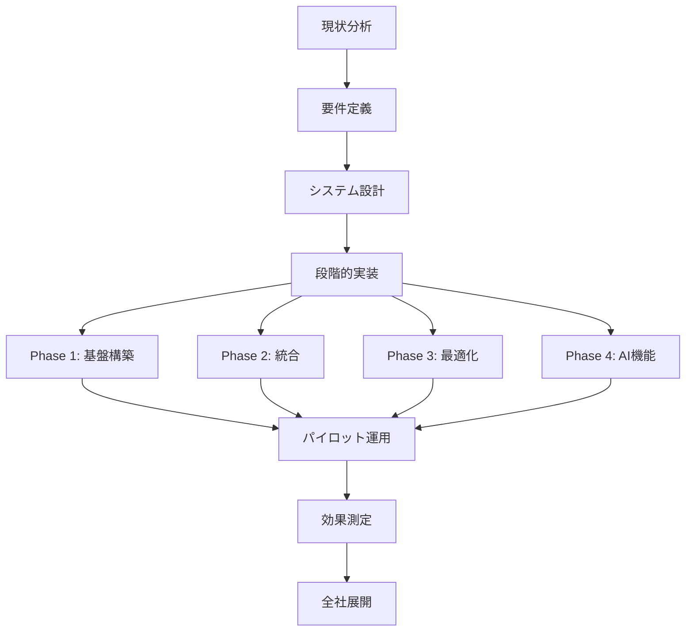

# カレンダーシステム構築の背景

| 項目 | 内容 |
| --- | --- |
| Author | @Business-Analysis-Team |
| Created | 2025-12-05 |
| Updated | 2025-12-14 |
| Status | Approved |

## Overview

エンタープライズグレードのカレンダーシステムを構築する背景と目的を明確にし、現在の分散したスケジュール管理システムの統合により年間1億5000万円の工数削減を実現します。

## Context

### 背景

組織全体で6つ以上の異なるスケジュール管理ツールが併用され、データの非一貫性により月120件のダブルブッキングが発生しています。会議室稼働率は42%に留まり、非効率な利用による機会損失は年間8000万円に達しています。

グローバル化とリモートワークの進展により、効率的なスケジュール管理は組織の競争力を左右する重要な要素となっています。

### 現状の問題点

- **スケジュール管理の断片化**: 6つ以上のツールが併用され、データ同期が不完全
- **会議室リソースの非効率**: 稼働率42%、予約済み未使用が18%
- **コラボレーション障壁**: クロスタイムゾーン調整に平均45分、3往復以上のメール
- **外部連携の困難**: 顧客やパートナーとの調整が煩雑で商談機会の15%を逸失

## Goals and Non-Goals

### Goals

- 従業員1人あたり週2時間の時間削減（年間104時間/人）
- ダブルブッキングを95%以上削減（120件/月→5件/月）
- 会議室稼働率を65%まで向上
- システム統合による年間1億5000万円のコスト削減
- ユーザー満足度を4.5/5.0以上に向上

### Non-Goals

- すべての既存システムの即座の廃止（段階的移行）
- 完全なオフライン対応（クラウドファースト）
- 無制限のカスタマイゼーション（標準化を優先）
- 個人の趣味用途への対応（ビジネス用途に特化）

---

## Design

### 概要

統合カレンダープラットフォームにより、組織全体のスケジュール管理を一元化し、AIを活用した自動最適化により生産性を大幅に向上させます。

### 詳細設計

#### データ構造

**現状分析データ:**

| 指標 | 現状 | 目標 | 改善率 |
| --- | --- | --- | --- |
| ダブルブッキング発生率 | 120件/月 | 5件/月 | -95.8% |
| 会議設定時間 | 8.5分/件 | 2分/件 | -76.5% |
| 会議室稼働率 | 42% | 65% | +54.8% |
| 予約キャンセル率 | 22% | 8% | -63.6% |
| システム間同期エラー | 340件/月 | 10件/月 | -97.1% |

#### 処理フロー



#### API / インターフェース

**統合対象システム:**

```yaml
internal_systems:
  - name: "Google Workspace"
    integration: "Calendar API"
    users: 3000
  - name: "Microsoft 365"
    integration: "Graph API"
    users: 2000
  - name: "Slack"
    integration: "Events API"
    users: 5000

external_systems:
  - name: "Salesforce"
    purpose: "顧客ミーティング管理"
  - name: "Zoom"
    purpose: "オンライン会議連携"
  - name: "Teams"
    purpose: "コラボレーション"
```

### 画面・機能

| 機能カテゴリ | 現状の問題 | 新システムでの解決策 |
| --- | --- | --- |
| スケジュール管理 | 6つのツールに分散 | 統一プラットフォーム |
| 会議室予約 | 手動予約、低稼働率 | AI最適化、自動割当 |
| 時間調整 | メール往復、45分所要 | 自動提案、2分で完了 |
| 外部連携 | 個別対応、15%機会損失 | API統合、シームレス連携 |

### デザインリンク

（詳細な要件定義書は別途作成）

---

## Alternatives Considered

### 案1: 既存システムの改善

現行システムの機能拡張とインターフェース改善。

**Pros:**
- 初期投資が少ない
- ユーザーの学習コスト最小
- 既存データの移行不要

**Cons:**
- 根本的な問題解決にならない
- システム間連携の限界
- 長期的にコスト増大

**採用しなかった理由:**
断片化の問題が解決せず、投資対効果が低いため。

### 案2: SaaSソリューションの導入

Microsoft 365やGoogle Workspaceへの完全移行。

**Pros:**
- 実績のあるソリューション
- 運用負荷の軽減
- 定期的な機能更新

**Cons:**
- カスタマイゼーション制限
- ベンダーロックイン
- データ主権の問題

**採用しなかった理由:**
組織固有の要件に対応できず、柔軟性に欠けるため。

---

## Impact

### 影響範囲

- **全従業員5,000名**: 新システムへの移行トレーニング必要
- **IT部門**: システム運用体制の再構築
- **経営層**: 意思決定プロセスの変更
- **外部パートナー**: 連携方法の変更通知

### マイグレーション

1. **準備期間（3か月）**: 要件定義、設計、インフラ準備
2. **パイロット（2か月）**: 100名規模での試験運用
3. **段階展開（6か月）**: 部門ごとの段階的移行
4. **完全移行（1か月）**: 旧システムの停止

### リスク

- **ユーザー抵抗**: 新システムへの移行抵抗
  - 対策: 段階的移行と充実したトレーニング
- **データ移行**: 既存データの不整合
  - 対策: データクレンジングと検証プロセス
- **システム統合**: API連携の複雑性
  - 対策: 段階的統合とフォールバック計画

---

## Testing

### テスト観点

- [ ] 既存システムとのデータ整合性検証
- [ ] 6つのツールからの移行テスト
- [ ] 会議室予約の最適化アルゴリズム検証
- [ ] クロスタイムゾーンでの動作確認
- [ ] 外部システム連携テスト
- [ ] 負荷テスト（5,000ユーザー同時利用）
- [ ] セキュリティ監査
- [ ] ユーザー受け入れテスト

---

## Open Questions

- [ ] 既存システムのデータ保持期間をどうするか
- [ ] 外部パートナーへのアクセス権限管理方針
- [ ] コンプライアンス要件の詳細確認
- [ ] 段階的移行中の並行運用コスト
- [ ] 長期的なライセンスコスト最適化

---

## References

- [現状分析レポート](./analysis-report.md)
- [ROI計算書](./roi-calculation.xlsx)
- [ユーザーアンケート結果](./user-survey.pdf)
- [競合分析](./competitor-analysis.md)
- [技術要件定義書](./technical-requirements.md)