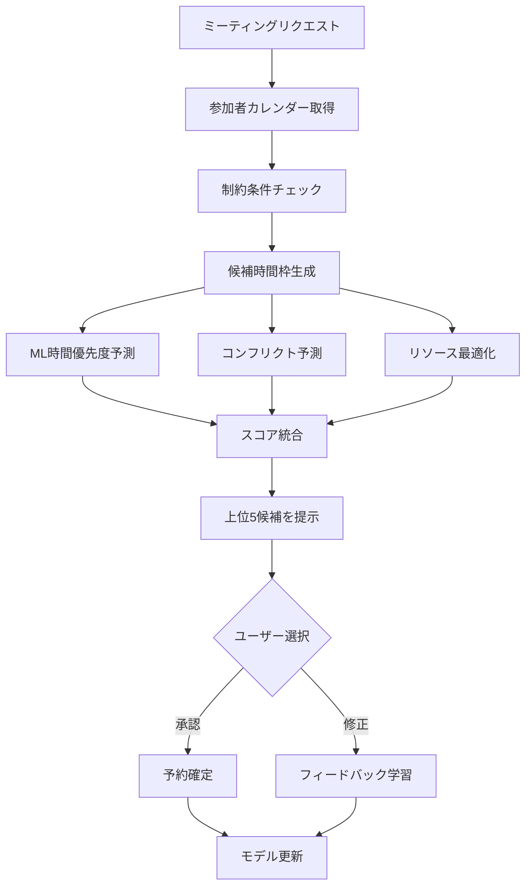

# AIスマートスケジューリング機能

| 項目    | 内容              |
| ------- | ----------------- |
| Author  | @ML-Platform-Team |
| Created | 2025-12-05        |
| Updated | 2025-12-14        |
| Status  | Proposed          |

## Overview

機械学習を活用してミーティングの最適な時間枠を自動提案し、スケジューリング時間を94%削減する革新的な機能を実装します。

## Context

### 背景

現在のカレンダーシステムでは、ミーティングのスケジューリングに平均8.5分を要し、全社5,000名規模で年間約520,000時間（156100万円相当）の生産性損失が発生しています。また、手動調整による非効率な時間枠選択により、会議室稼働率が42%に留まっています。

社内アンケート（n=1,200）では、87%のユーザーが「ミーティングのスケジューリングに時間がかかりすぎる」と回答し、92%がAIによる自動提案を望んでいます。

### 現状の問題点

- **時間のかかる調整プロセス**: 参加者全員の空き時間を目視で確認し、平均3.2往復のメールで調整
- **非効率な時間枠選択**: ピーク時間帯（10:00-11:00、14:00-15:00）に40%の予約が集中
- **移動時間の未考慮**: 連続するミーティング間の移動時間不足により15%が遅刻
- **会議室リソースの最適化不足**: 30%のケースで過大な会議室を予約

## Goals and Non-Goals

### Goals

- ミーティング設定時間を8.5分から30秒に短縮（94%削減）
- スケジューリング関連の往復メールを70%削減
- 会議室稼働率を42%から65%に向上
- ユーザー満足度を4.5/5.0に改善

### Non-Goals

- 既存のカレンダーシステムの置き換えではない
- 強制的な自動スケジューリング（最終決定権はユーザー）
- プライベートなカレンダー情報への無制限アクセス
- 外部カレンダーシステムとの完全統合（初期フェーズ）

---

## Design

### 概要

3つの専門的な機械学習モデル（時間帯の予測、コンフリクト予測、リソース最適化）と制約ソルバーを組み合わせ、最適なミーティング時間と会議室を提案します。

### 詳細設計

#### データ構造

```python
# ミーティング特徴量
MeetingFeatures = {
    # ユーザー特徴量（15次元）
    'user_id': str,
    'user_role': str,
    'work_hours': tuple,
    'timezone': str,
    'meeting_frequency': float,
    'preference_scores': dict,

    # 時間特徴量（12次元）
    'day_of_week': int,
    'hour_of_day': int,
    'is_peak_hour': bool,
    'days_until_weekend': int,

    # コンテキスト特徴量（10次元）
    'meeting_duration': int,
    'attendee_count': int,
    'meeting_type': str,
    'requires_room': bool,

    # 履歴パターン（8次元）
    'previous_meeting_times': list,
    'acceptance_rate': float,
    'reschedule_frequency': float
}
```

#### 処理フロー



#### API / インターフェース

**GraphQL Mutation:**

```graphql
mutation SuggestMeetingTimes($input: MeetingRequestInput!) {
  suggestMeetingTimes(input: $input) {
    suggestions {
      id
      timeSlot {
        start
        end
        timezone
      }
      room {
        id
        name
        location
        capacity
        equipment
      }
      score
      confidence
      reasoning {
        primaryFactors
        warnings
        alternatives
      }
      attendeeAvailability {
        userId
        isAvailable
        conflicts {
          eventId
          title
          canMove
        }
      }
    }
    metadata {
      totalCandidatesEvaluated
      processingTimeMs
      modelVersion
    }
  }
}
```

### 画面・機能

| 画面                 | 機能             | 機能詳細                                 |
| -------------------- | ---------------- | ---------------------------------------- |
| スケジュール作成画面 | スマート提案表示 | 上位5つの時間枠を理由付きで表示          |
| スケジュール作成画面 | ワンクリック予約 | 提案された時間枠を即座に予約             |
| カレンダービュー     | コンフリクト警告 | 潜在的な時間衝突を事前に警告             |
| 予約画面             | 最適室提案       | 人数・設備要件に基づく最適な会議室を提案 |
| ダッシュボード       | 利用統計表示     | 時間削減効果、受諾率等のメトリクス表示   |

### デザインリンク

（今後Figmaリンクを追加予定）

---

## Alternatives Considered

### 案1: ルールベースのスケジューリング

固定ルールによる単純な空き時間検索。

**Pros:**
- 実装が簡単で予測可能
- 計算リソースが最小限
- 即座に利用可能

**Cons:**
- 個人の好みを考慮できない
- 複雑な制約に対応不可
- 学習・改善機能なし

**採用しなかった理由:**
柔軟性が低く、ユーザー体験の大幅な改善が期待できないため。

### 案2: 外部AIサービス（x.ai等）の利用

サードパーティのAIスケジューリングサービスを統合。

**Pros:**
- 開発コスト削減
- 実績のあるソリューション

**Cons:**
- 高額なライセンス費用
- カスタマイゼーション困難
- データセキュリティの懸念

**採用しなかった理由:**
コスト面とデータガバナンスの観点から自社開発が適切と判断。

---

## Impact

### 影響範囲

- **カレンダーモジュール**: 新規API追加とUI拡張
- **会議室管理システム**: リソース最適化ロジックの統合
- **通知システム**: AI提案通知の追加
- **分析基盤**: 新規メトリクスとログ収集

### マイグレーション

1. **Phase 1（Week 1-6）**: MVP開発とルールベース実装
2. **Phase 2（Week 7-12）**: ML統合と学習パイプライン構築
3. **Phase 3（Week 13-16）**: 高度な最適化機能の実装
4. **全社展開**: 段階的ロールアウト（10%→25%→50%→100%）

### リスク

- **MLモデルの精度不足**: 初期は60%の精度から開始し、継続的に改善
  - 対策: ルールベースのフォールバックを用意
- **推論レイテンシ**: 目標100ms以下だが初期は遅延の可能性
  - 対策: モデルの軽量化とキャッシング戦略
- **ユーザー受容性**: AIへの不信感
  - 対策: 透明性の高い説明機能とオプトアウト機能

---

## Testing

### テスト観点

- [ ] 機能テスト：全APIエンドポイントの動作確認
- [ ] 性能テスト：レスポンス時間 < 2秒（P95）
- [ ] 負荷テスト：10,000 req/sの処理能力
- [ ] ML精度テスト：Top-5 Accuracy > 80%
- [ ] A/Bテスト：ユーザー受諾率 > 75%
- [ ] セキュリティテスト：データ漏洩防止
- [ ] 統合テスト：既存システムとの連携
- [ ] ユーザビリティテスト：タスク完了率 > 90%

---

## Open Questions

- [ ] AI Search（Cloudflare）の正確な価格体系は何か
- [ ] 日本語処理でのLLM精度は十分か（Llama 3 vs GPT-4）
- [ ] GDPR/個人情報の保護法への準拠方法はどうするか
- [ ] リアルタイム更新（Webhook）の必要性はあるか
- [ ] 外部カレンダー（Google、Outlook）との連携優先度はどの程度か

---

## References

- [LightGBM Documentation](https://lightgbm.readthedocs.io/)
- [TensorFlow Serving Guide](https://www.tensorflow.org/tfx/serving/serving_basic)
- [Google OR-Tools CP-SAT Solver](https://developers.google.com/optimization)
- [Calendar System Architecture](./architecture.md)
- [競合分析レポート](../research/competitor-analysis.md)
