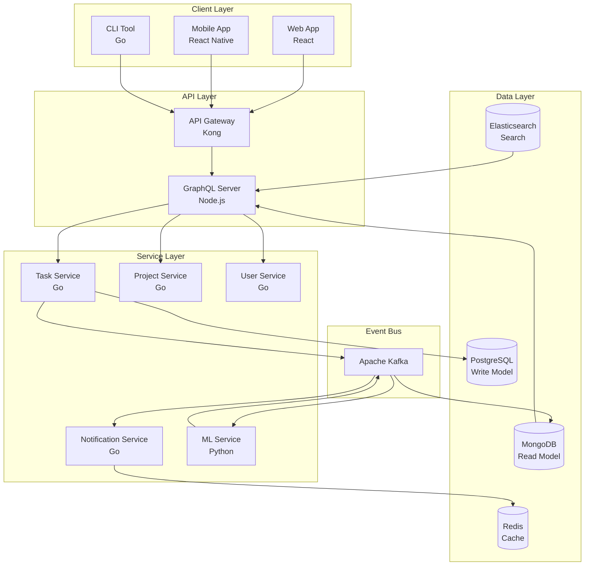

# タスク管理システムアーキテクチャ

| 項目 | 内容 |
| --- | --- |
| Author | @Technical-Architecture-Review-Board |
| Created | 2025-12-05 |
| Updated | 2025-12-14 |
| Status | Approved |

## Overview

エンタープライズグレードのタスク管理システムの技術アーキテクチャを定義し、マイクロサービスアーキテクチャとCQRSパターンに基づく高性能システムを実現します。

## Context

### 背景

現代の企業では、複数のチームが多様なツールを使用してタスクを管理しており、組織全体の生産性が低下しています。分散したタスク管理ツール、プロジェクト可視性の欠如、チーム間の連携不全により、年間780,000時間もの工数が無駄になっています。

統一されたタスク管理プラットフォームにより、組織全体のワークフローを最適化し、プロジェクトの成功率を大幅に向上させる必要があります。

### 現状の問題点

- **データサイロ化**: ツール間のデータサイロにより全社的な進捗把握が困難
- **生産性損失**: 複数システム間での情報転記に年間780,000時間を消費
- **プロジェクト遅延**: 納期遅延率42%、予算超過率28%
- **連携不全**: チーム間のタスク依存関係の管理が不明瞭

## Goals and Non-Goals

### Goals

- 同時ユーザー10,000名以上のサポート
- 50,000リクエスト/秒のスループット達成
- 99.95%の可用性実現（年間ダウンタイム4.38時間以内）
- P95レスポンス時間を150ms以内に抑制
- AIによる自動化で生産性を30%向上

### Non-Goals

- 既存タスク管理ツールの即座の置き換え（段階的移行を採用）
- 無制限のカスタマイゼーション（標準化を優先）
- レガシーシステムとの完全互換性（APIによる連携に限定）
- オフライン専用機能（クラウドファーストで設計）

---

## Design

### 概要

マイクロサービスアーキテクチャとCQRSパターンを採用し、読み取りと書き込みを分離することで高いスケーラビリティを実現します。イベント駆動アーキテクチャにより、サービス間の疎結合を維持しながら、リアルタイムな状態同期を実現します。

### 詳細設計

#### データ構造

**技術スタック:**
```yaml
backend:
  services:
    - language: Go
      purpose: コアサービス（Task、Project、User）
    - language: Python
      purpose: ML/AI サービス（優先順位、推奨）

frontend:
  - framework: React + TypeScript
    purpose: SPAアプリケーション
  - framework: Next.js
    purpose: SSR/SSG対応

datastore:
  - primary: PostgreSQL
    purpose: トランザクショナルデータ（OLTP）
  - document: MongoDB
    purpose: 柔軟なスキーマデータ
  - cache: Redis
    purpose: セッション、キャッシュ
  - search: Elasticsearch
    purpose: 全文検索、分析

messaging:
  - platform: Apache Kafka
    purpose: イベントストリーミング、CQRS

infrastructure:
  - cloud: AWS
    components:
      - EKS: Kubernetes orchestration
      - RDS: Managed PostgreSQL
      - DocumentDB: Managed MongoDB
      - ElastiCache: Managed Redis
      - MSK: Managed Kafka
```

#### 処理フロー



#### API / インターフェース

**GraphQL Schema:**

```graphql
type Task {
  id: ID!
  title: String!
  description: String
  status: TaskStatus!
  priority: Priority!
  assignee: User
  project: Project
  dependencies: [Task]
  createdAt: DateTime!
  updatedAt: DateTime!
  aiSuggestions: AISuggestions
}

type Mutation {
  createTask(input: CreateTaskInput!): Task!
  updateTask(id: ID!, input: UpdateTaskInput!): Task!
  deleteTask(id: ID!): Boolean!
  assignTask(taskId: ID!, userId: ID!): Task!
  updateTaskPriority(taskId: ID!, priority: Priority!): Task!
}

type Query {
  task(id: ID!): Task
  tasks(filter: TaskFilter, page: PageInput): TaskConnection!
  myTasks(status: TaskStatus): [Task]!
  taskSuggestions: [TaskSuggestion]!
}

type Subscription {
  taskUpdated(taskId: ID!): Task!
  taskCreated(projectId: ID!): Task!
}
```

### 画面・機能

| コンポーネント | 機能 | 技術詳細 |
| --- | --- | --- |
| Task Service | タスク管理CRUD | Go、gRPC、PostgreSQL |
| Project Service | プロジェクト管理 | Go、gRPC、PostgreSQL |
| ML Service | AI優先順位付け | Python、TensorFlow、Kafka |
| Notification Service | 通知配信 | Go、WebSocket、FCM/APNS |
| Search Service | 全文検索、フィルタ | Go、Elasticsearch |

### デザインリンク

（システムアーキテクチャ図は実装フェーズで詳細化）

---

## Alternatives Considered

### 案1: モノリシックアーキテクチャ

単一のアプリケーションですべての機能を実装。

**Pros:**
- 開発が簡単
- デプロイが単純
- トランザクション管理が容易

**Cons:**
- スケーラビリティの制限
- 技術スタックの固定化
- 障害時の影響範囲が大きい

**採用しなかった理由:**
スケーラビリティと独立したデプロイメントの要件を満たせないため。

### 案2: サーバーレスアーキテクチャ

AWS Lambda等を使用した完全サーバーレス構成。

**Pros:**
- 自動スケーリング
- 使用量ベースの課金
- 運用負荷の削減

**Cons:**
- ベンダーロックイン
- ローカル開発の複雑性
- ステートフル処理の制限

**採用しなかった理由:**
複雑なワークフローとステートフル処理の要件から、コンテナベースを選択。

---

## Impact

### 影響範囲

- **既存システム**: 6か月間の並行稼働後、段階的に廃止
- **開発チーム**: マイクロサービス、Kubernetes、イベント駆動の習得
- **運用チーム**: 分散システムの監視・運用スキル習得
- **コスト**: 初期投資は30%増、運用開始後は15%削減見込み

### マイグレーション

1. **Phase 1（Month 1-2）**: インフラストラクチャ構築とコアサービス実装
2. **Phase 2（Month 3-4）**: タスク・プロジェクト管理機能の移行
3. **Phase 3（Month 5-6）**: AI/ML機能の統合と最適化
4. **Phase 4（Month 7-8）**: 全社展開と既存システムの段階的廃止

### リスク

- **技術的複雑性**: マイクロサービスの運用複雑性
  - 対策: 段階的導入と包括的なトレーニングプログラム
- **データ一貫性**: 分散データの整合性維持
  - 対策: CQRSとイベントソーシングによる最終整合性
- **パフォーマンス**: サービス間通信のレイテンシ
  - 対策: キャッシング戦略とサービスメッシュの活用

---

## Testing

### テスト観点

- [ ] 単体テスト（カバレッジ85%以上）
- [ ] 統合テスト（全APIエンドポイント）
- [ ] 負荷テスト（50,000 req/s）
- [ ] カオスエンジニアリング
- [ ] セキュリティテスト（OWASP Top 10）
- [ ] E2Eテスト（クリティカルパス）
- [ ] パフォーマンステスト（P95 < 150ms）
- [ ] データ移行テスト

---

## Open Questions

- [ ] MLモデルの更新頻度とパイプライン設計
- [ ] マルチテナンシーの実装方針
- [ ] 外部システムとのAPI連携優先順位
- [ ] データアーカイブとコンプライアンス要件
- [ ] ディザスタリカバリーのRTO/RPO目標値

---

## References

- [CQRS Pattern](https://martinfowler.com/bliki/CQRS.html)
- [Event Sourcing](https://martinfowler.com/eaaDev/EventSourcing.html)
- [Microservices Best Practices](https://microservices.io/patterns/)
- [AWS Well-Architected Framework](https://aws.amazon.com/architecture/well-architected/)
- [Kubernetes Patterns](https://k8spatterns.io/)