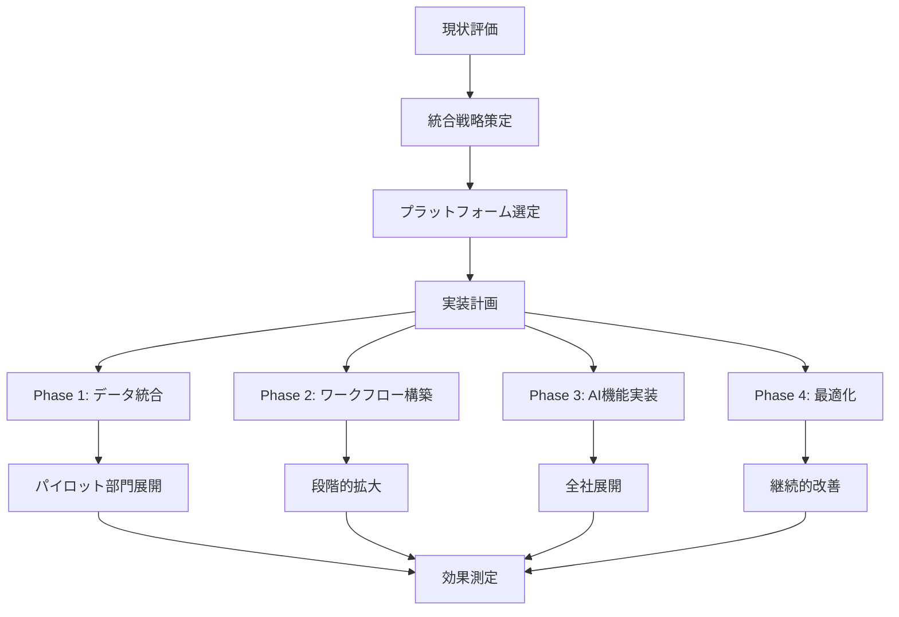

# タスク管理システム構築の背景

| 項目 | 内容 |
| --- | --- |
| Author | @Product-Strategy-Team |
| Created | 2025-12-05 |
| Updated | 2025-12-14 |
| Status | Approved |

## Overview

統合タスク管理プラットフォームを構築する背景と目的を明確にし、現在の断片化したタスク管理の統一により年間11億7000万円の生産性向上を実現します。

## Context

### 背景

現代の組織では、平均12種類の異なるタスク管理ツールが併用され、情報の断片化により重要な意思決定が遅延しています。全社員の42%が「タスクの優先順位付けが困難」と回答し、プロジェクト納期遅延率は42%に達しています。

デジタルトランスフォーメーションの加速により、効率的なタスク管理は組織の競争優位性を決定づける重要な要素となっています。

### 現状の問題点

- **ツールの乱立**: 12種類のツール併用により情報が分散
- **可視性の欠如**: プロジェクト全体の進捗把握に平均2.5時間/週を消費
- **連携不全**: チーム間の依存関係が不明確で、ブロッカーの発見が遅延
- **生産性損失**: タスク管理の非効率により年間780,000時間の工数損失

## Goals and Non-Goals

### Goals

- タスク管理ツールを統一プラットフォームに集約
- プロジェクト納期遵守率を85%に向上（現状58%）
- タスク優先順位付け時間を70%削減
- 年間11億7000万円の生産性向上を実現
- リアルタイムな進捗可視化の実現

### Non-Goals

- 個人の趣味プロジェクトへの対応（ビジネス用途に特化）
- 無制限のカスタムフィールド（標準化を優先）
- 完全なオフライン対応（クラウドファースト）
- レガシーツールとの100%互換性（段階的移行）

---

## Design

### 概要

AIを活用した統合タスク管理プラットフォームにより、組織全体のワークフローを最適化し、データドリブンな意思決定を支援します。

### 詳細設計

#### データ構造

**現状分析データ:**

| 指標 | 現状 | 目標 | 改善効果 |
| --- | --- | --- | --- |
| 使用ツール数 | 12種類 | 1種類 | -91.7% |
| 納期遵守率 | 58% | 85% | +46.6% |
| 優先順位付け時間 | 30分/日 | 9分/日 | -70% |
| タスク発見遅延 | 3.5日 | 0.5日 | -85.7% |
| 年間工数損失 | 780,000時間 | 156,000時間 | -80% |

#### 処理フロー



#### API / インターフェース

**統合対象システム:**

```yaml
project_management:
  - name: "Jira"
    users: 2000
    data_volume: "500GB"
  - name: "Asana"
    users: 1500
    data_volume: "200GB"
  - name: "Trello"
    users: 800
    data_volume: "100GB"

collaboration:
  - name: "Slack"
    integration: "Task creation, notifications"
  - name: "Teams"
    integration: "Task updates, comments"
  - name: "Email"
    integration: "Task assignment, reminders"

development:
  - name: "GitHub"
    purpose: "Code-related tasks"
  - name: "GitLab"
    purpose: "CI/CD pipeline tasks"
  - name: "Jenkins"
    purpose: "Build automation tasks"
```

### 画面・機能

| 機能カテゴリ | 現状の課題 | 新システムでの解決策 |
| --- | --- | --- |
| タスク管理 | 12ツールに分散 | 統一ダッシュボード |
| 優先順位付け | 手動、主観的 | AI自動提案 |
| 進捗管理 | リアルタイム性欠如 | リアルタイム更新 |
| レポーティング | 手動集計、2日遅延 | 自動生成、即時 |

### デザインリンク

（詳細な機能仕様書は別途作成）

---

## Alternatives Considered

### 案1: 既存ツールの連携強化

APIとWebhookによる既存ツール間の連携強化。

**Pros:**
- 既存投資の活用
- ユーザー教育不要
- 段階的に実装可能

**Cons:**
- 複雑性の増大
- メンテナンスコスト増加
- 根本的解決にならない

**採用しなかった理由:**
システムの複雑性が増し、長期的にメンテナンス不可能になるため。

### 案2: 特定ベンダーソリューションへの統一

JiraやAsanaなど単一ベンダーへの完全移行。

**Pros:**
- 実績のあるソリューション
- サポート体制充実
- 定期的アップデート

**Cons:**
- ベンダーロックイン
- カスタマイズ制限
- ライセンスコスト増大

**採用しなかった理由:**
組織固有の要件に対応できず、将来的な柔軟性を失うため。

---

## Impact

### 影響範囲

- **全社員10,000名**: 新システムへの移行と教育
- **プロジェクトマネージャー500名**: 管理手法の変更
- **開発チーム2,000名**: ワークフローの再設計
- **経営層**: レポーティング体系の変更

### マイグレーション

1. **Phase 1（Month 1-3）**: データ統合と基盤構築
2. **Phase 2（Month 4-6）**: パイロット部門での運用
3. **Phase 3（Month 7-9）**: 段階的な全社展開
4. **Phase 4（Month 10-12）**: 最適化と旧システム廃止

### リスク

- **変更管理**: 組織文化の変革抵抗
  - 対策: チェンジエージェントの育成と段階的導入
- **データ品質**: 既存データの不整合
  - 対策: データクレンジングと検証プロセス
- **システム依存**: 単一システムへの過度な依存
  - 対策: バックアップとディザスタリカバリー計画

---

## Testing

### テスト観点

- [ ] 12ツールからのデータ移行検証
- [ ] ワークフロー互換性テスト
- [ ] AI優先順位付けアルゴリズム検証
- [ ] 負荷テスト（10,000ユーザー同時利用）
- [ ] API統合テスト
- [ ] セキュリティ監査
- [ ] ユーザビリティテスト
- [ ] パフォーマンステスト

---

## Open Questions

- [ ] データ保持ポリシーの詳細
- [ ] 外部委託業者のアクセス管理
- [ ] カスタムワークフローの移行方針
- [ ] AIモデルの学習データ管理
- [ ] 長期的なコスト最適化戦略

---

## References

- [現状分析レポート](./current-state-analysis.md)
- [ROI分析](./roi-analysis.xlsx)
- [ツール利用状況調査](./tool-usage-survey.pdf)
- [ベンダー比較表](./vendor-comparison.md)
- [要件定義書](./requirements.md)